# 🛍️ Awesome-Shelf-Intelligence-Platform

  
  
  
  
  

## 📌 Top Shelf Intelligence Platform Ecosystem

**Curated List of SaaS Products & Open-Source GitHub Projects**  
*Focused on Retail Shelf Monitoring, Planogram Compliance, Out-of-Stock Detection, Share of Shelf & Computer Vision for CPG/Retail Execution*  
🗓️ **Last updated: September 2026**

---

## 📖 Introduction & Market Context

This repository tracks notable **SaaS platforms** and **open-source computer vision projects** dedicated to **Shelf Intelligence**, **Planogram Compliance**, and **Retail Execution**. Enterprise shelf monitoring systems leverage advanced artificial intelligence, dense object detection models (such as YOLOv8/YOLO11 fine-tuned on SKU-110K), vector embeddings, and autonomous store robotics (e.g., Simbe Tally) to transform store shelf imagery into real-time operational insights for CPG brands and retail operators.

---

## 📑 Table of Contents
- [🏢 SaaS/Hosted Platforms](#-saashosted-platforms)
- [💻 Open-Source GitHub Projects](#-open-source-github-projects)
- [🛠️ Key Frameworks & Datasets](#️-key-frameworks--datasets)
- [🤝 How to Contribute](#-how-to-contribute)
- [⚠️ Disclaimer](#️-disclaimer)
- [📈 Star History](#-star-history)

---

## 🏢 SaaS/Hosted Platforms

📊 **Market Insights**: The global Retail Shelf Intelligence & Computer Vision market is estimated at **$3.2 Billion in 2026** (projected to reach $8.5 Billion by 2030 at a CAGR of 21.4%). The sector is **moderately fragmented**, with enterprise category leaders (Trax, Scandit, Simbe) competing alongside specialized vertical planogram and retail execution SaaS platforms, rather than a single winner-take-all monopoly.

*Note: The table below is sorted by **Company Size (Valuation / Revenue) in Descending Order**.* ⬇️

| 🏢 Platform / Product | 📝 Description | 💰 Pricing (Starting Tier) | 🎁 Free Tier / Free Trial Limits | 📊 Company Size (Valuation / Rev) |
| :--- | :--- | :--- | :--- | :--- |
| **[Trax Retail](https://traxretail.com/)** | Global retail execution and image-recognition platform for shelf analytics, planogram compliance, and share-of-shelf. | $1.00 / store audit (baseline audit unit pricing) | **14-day proof-of-concept pilot** (limited to 1 store location & sample SKU catalog) | **~$1.3B Valuation / $100M+ Rev** |
| **[Scandit ShelfView / SDK](https://www.scandit.com/)** | Mobile computer-vision SDK enabling shelf barcode scanning, shelf-scene recognition, and audit workflows. | $199 / month (Scandit Express / SDK starting tier) | **30-day free trial** (includes full Data Capture SDK test license key & 100 test scans) | **~$1.0B Valuation / $50M+ Rev** |
| **[Caper AI (Instacart)](https://www.caper.ai/)** | Computer-vision smart cart and retail recognition platform tracking product selection and shelf availability. | $250 / cart / month (Smart cart hardware & AI subscription) | **30-day in-store pilot trial** (up to 5 smart carts for customer evaluation) | **~$350M Valuation (Parent $10B+)** |
| **[Simbe Robotics (Tally)](https://www.simberobotics.com/)** | Autonomous shelf-auditing robot using computer vision to scan store shelves for out-of-stocks, price errors, and planogram drift. | $2,000 / month per store (Robotics-as-a-Service model) | **30-day pilot program** (includes initial store mapping and automated shelf scan trial) | **~$200M Valuation / $20M+ Rev** |
| **[Focal Systems](https://focal.systems/)** | AI shelf-camera platform continuously monitoring on-shelf availability, planogram compliance, and out-of-stocks. | $200 / store / month (AI software & shelf camera tier) | **30-day store pilot** (includes hardware setup and shelf monitoring for up to 2 aisles) | **~$150M Valuation / $15M+ Rev** |
| **[ParallelDots ShelfWatch](https://www.paralleldots.com/)** | AI-powered shelf monitoring and retail execution platform turning shelf images into actionable compliance data. | $500 / month (Starter pilot subscription tier) | **7-day proof-of-concept pilot** (sample image recognition analysis up to 50 shelf photos) | **~$50M Valuation / $8M+ Rev** |
| **[Repsly](https://www.repsly.com/)** | Mobile retail execution and field audit platform for tracking on-shelf availability, shelf photos, and brand compliance. | $29 / user / month (Field Audit starting tier) | **14-day free trial** (full feature access for up to 5 field representatives) | **~$40M Valuation / $12M+ Rev** |
| **[PlanoHero](https://planohero.com/)** | AI-assisted SaaS platform for planogram creation, shelf layout automation, and retail store compliance tracking. | $199 / month (Lite Plan) | **14-day free trial** (supports up to 5,000 SKUs & 100 planograms, no credit card required) | **~$25M Valuation / $5M+ Rev** |
| **[Quant Retail](https://www.quantretail.com/)** | Retail space planning and planogram management solution offering automated shelf layout and store floor planning. | €1,200 / user / year (~$110 / mo equivalent, Quant Basic) | **30-day free trial** for Quant Basic (or 14-day free trial for Quant Planogramming) | **~$20M Valuation / $4M+ Rev** |
| **[Planorama / Teamcore](https://www.planorama.com/)** | Specialized retail execution and shelf-intelligence solutions serving regional markets with image recognition. | $150 / user / month (Field rep audit app starting tier) | **14-day evaluation trial** (up to 3 field users and 50 audit images) | **~$20M Valuation / $4M+ Rev** |
| **[DotActiv](https://dotactiv.com/)** | Cloud-based planogram and shelf space management software with retail analytics and automated layout generation. | $70 / user / month (Lite Plan) | **Free Forever plan** (limited to 40 products per single-drop planogram) or 14-day free trial on paid plans | **~$15M Valuation / $3M+ Rev** |
| **[PlanogramBuilder](https://www.planogrambuilder.com/)** | 3D and 2D web-based planogram creation tool for visual merchandising, shelf layout, and product positioning analysis. | $524 / year (~$44 / mo equivalent, Light 2D license) | **30-day free trial** (access to full feature set with watermarked exports, no credit card required) | **~$10M Valuation / $2M+ Rev** |
| **[Shelf Logic (ProView)](https://www.shelflogic.com/)** | Visual planogram and shelf layout software for store managers, CPG reps, and merchandising teams. | $14.99 / month (ProView Small cloud subscription) | **Free trial edition** (unlimited duration, watermarked planogram view & export, saving disabled) | **~$5M Valuation / $1M+ Rev** |

---

## 💻 Open-Source GitHub Projects

*Note: Repositories below are sorted by **GitHub Star Count (Descending)**.* ⬇️

1. **[ultralytics/ultralytics](https://github.com/ultralytics/ultralytics)**  ⚡  
   Leading real-time object detection framework supporting YOLOv8 and YOLO11 fine-tuning, dense object detection, and benchmark inference on the SKU-110K retail shelf dataset.

2. **[SKU110K_CVPR19](https://github.com/eg4000/SKU110K_CVPR19)**  📸  
   Official CVPR 2019 dataset and object detection benchmark for densely packed retail shelf scenes with overlapping SKU items and dense visual clutter.

3. **[Retail-Shelf-Monitoring](https://github.com/Alijanloo/Retail-Shelf-Monitoring)**  🔍  
   Real-time retail shelf monitoring system using computer vision and machine learning to detect out-of-stocks, misplaced items, and support planogram compliance analysis.

4. **[StoreEye](https://github.com/ALL-FOR-ONE-TECH/StoreEye-Enterprise-API-AI-Pipeline)**  👁️  
   Open-source, brand-agnostic FMCG shelf intelligence platform aimed at shelf visibility, planogram compliance, and competitive share-of-shelf analytics.

5. **[Shelf Management (academic pipeline)](https://github.com/rokopi-byte/shelf_management)**  📚  
   Deep-learning codebase and dataset accompanying research on shelf visual monitoring, product recognition, and planogram-related tasks.

6. **[cvpce – Planogram Compliance Evaluation](https://github.com/laitalaj/cvpce)**  📊  
   Computer-vision toolkit focused on evaluating planogram compliance from shelf images (research/academic origin).

7. **[Empty-Shelf-Alert-System](https://github.com/K-saif/Empty-Shelf-Alert-System)**  ⚠️  
   Production-ready YOLO11 empty shelf detection and automated out-of-stock notification pipeline using weakly-supervised relabeling.

8. **[AWS / cloud guidance samples](https://github.com/aws-solutions-library-samples/guidance-for-managing-planograms-with-amazon-bedrock)**  ☁️  
   Reference architectures and sample code for planogram generation and compliance checking using cloud AI services (Amazon Bedrock).

---

## 🛠️ Key Frameworks & Datasets

- 🎯 **Object detection frameworks**: YOLOv8, YOLO11, Detectron2, and torchvision models fine-tuned on dense retail imagery.
- 🔍 **Feature extraction & retrieval**: CLIP embeddings, ResNet/MobileNet feature vectors, paired with FAISS or Qdrant for SKU visual matching.
- 📦 **Dataset resources**: Public shelf datasets (SKU-110K, Grozi-3.2k, RPC) used to benchmark product localization algorithms.
- 🏷️ **Annotation & Labelling tools**: Label Studio and CVAT workflows supporting shelf product bounding boxes and polygon segmentation.
- ⚡ **Edge deployment**: TensorRT, TFLite, and ONNX runtimes for running shelf monitoring models on store cameras or mobile devices.

---

## 🤝 How to Contribute

1. Fork the repository.
2. Add or edit entries in `README.md` following the tabular format.
3. Include: name, link, concise description, starting price, free trial limit, and market valuation/revenue details.
4. Submit a Pull Request with a clear explanation of your additions.

⭐ **Star the repo if you find it useful for retail vision and shelf analytics!**

---

## ⚠️ Disclaimer

- This is a **community-curated list** — for informational purposes only.
- Commercial shelf intelligence systems govern retail compliance, supplier SLA enforcement, and inventory auditing. Accuracy, light sensitivity, and camera positioning must be thoroughly validated in real store conditions.

---

## 📈 Star History

---

  <b>Curated for CPG Brands, Retail Execution Leaders, Computer Vision Engineers & Store Ops Teams</b>  
   
  <i>Reference list maintained by <a href="https://github.com/ishandutta2007/Awesome-Awesome-Awesome">Awesome-Awesome-Awesome</a>.</i>

